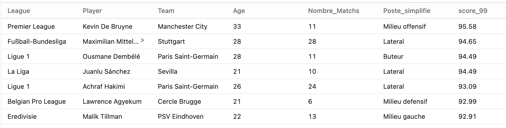

# ⚽ Scouting intelligent pour le Como 1907 (football professionnel)

📊 Projet de groupe de 2 semaines réalisé dans le cadre de la formation **Data Analytics du Wagon**.

Nous nous sommes positionnés en tant qu’équipe data analyst du **Como 1907**, club de **football professionnel** (10ᵉ de Serie A en 2024-2025), avec l’objectif de concevoir un **outil de scouting intelligent** pour accompagner le club dans son ambition d’atteindre la **Ligue des Champions** l'année prochaine (top 4 de Série A).

---

## 🧠 Démarche (résumée en 5 étapes)

### Étape 1 – Collecte des données

- Web scraping des **statistiques individuelles des joueurs pour chaque match** depuis le site **FBref**, référence mondiale en data football, à l’aide du package **`worldfootballR`** (en R)
- Extraction des **valeurs marchandes actualisées** des joueurs via un script personnalisé sur **Transfermarkt**

- Les données couvrent les **5 plus grands championnats européens** :
  - **Premier League** (Angleterre)  
  - **La Liga** (Espagne)  
  - **Serie A** (Italie)  
  - **Bundesliga** (Allemagne)  
  - **Ligue 1** (France)

➡️ Chaque ligne du dataset correspond à un **joueur pour un match donné**, ce qui permet une analyse fine et dynamique des performances dans le temps.  
➡️ Cette base large et granulaire permet de comparer les profils potentiels issus de différents championnats pour identifier les meilleurs candidats au recrutement.

  
*Exemple de web scraping réalisé avec le package R `worldfootballR`*

### Étape 2 – Ingestion & nettoyage des données (DBT et SQL)

- Import des deux sources de données via **DBT** (Data Build Tool)
- Nettoyage et structuration initiale pour rendre les données cohérentes et prêtes à être transformées

### Étape 3 – Calcul d’un score prédictif

- Transformation des données statistiques avec **DBT** pour créer des variables analytiques : ratios par 90 minutes (`per90`), statistiques offensives, défensives ou liées à la construction du jeu.

- Élaboration d’un **modèle de scoring personnalisé**, calculé **poste par poste** (milieux, attaquants, défenseurs, gardiens…).

- Pour chaque poste, nous avons suivi la démarche suivante :

  - 🔍 **Identification des statistiques les plus pertinentes** en fonction du poste (ex. : xG pour les attaquants, tacles et interceptions pour les défenseurs)
  - 📐 **Standardisation des indicateurs** via des ratios `per90` pour lisser les différences de temps de jeu entre les joueurs
  - ⚖️ **Application de pondérations personnalisées** à chaque statistique, selon son importance relative dans la performance attendue pour le poste
  - ➕ **Agrégation des scores pondérés** pour produire un score final entre 0 et 100
  - 🧪 **Vérification de la cohérence du classement** des joueurs par poste (validation manuelle et croisement avec des performances réelles)

➡️ Ce score permet très facilement de comparer les différents joueurs

*Visualisation des joueurs avec leur score associé (extrait de DBT)*

### Étape 4 – Jointure entre le score et la valeur marchande

- Fusion des données de performance (FBref) et de valeur marchande (Transfermarkt)
- Génération d’un modèle **`mart` final exploitable** dans un dashboard interactif sur **Looker Studio**

### Étape 5 – Visualisation finale & recommandations (Looker Studio)

- Création d’un dashboard dynamique avec **Looker Studio**
- Présentation du **contexte club**, analyse des performances actuelles de l’équipe et identification des manques
- **Exploration interactive des joueurs** selon leur poste, leur score prédictif et leur valeur marchande
- Visualisation des performances à l’aide de **spider charts** comparant chaque joueur analysé au **profil recommandé**
- Formulation de **recommandations concrètes de recrutement** par poste clé
- **Conclusion : projection de la future équipe type** intégrant les recrues identifiées

*Matrice de sélection permettant de filtrer les profils selon les critères définis*

---

## 🛠️ Stack & outils

- 🧮 SQL (nettoyage, transformation et modélisation)
- 🧱 DBT (versioning)
- 📈 R (web scraping avec worldfootballR)
- 📊 Looker Studio (visualisation finale)
- 🐍 Python (les Spider Chart pour le Looker)

---

## 📁 Structure du projet

 - `Scripts_R/` → contient des exemples de script R pour le scrapping

Dans models : 

- `staging/` → contient les **données brutes scrappées**, importées depuis FBref et Transfermarkt

- `intermediate/` → toutes les étapes de **nettoyage, transformation et modélisation analytique** (ratios, scoring…)

- `mart/` → les **tables finales** prête à être visualisée dans Looker Studio

- `analyses/` → des **analyses SQL complémentaires** pour mieux comprendre les profils et performances des joueurs

